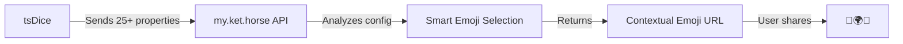

# 🎉 tsDice API Integration Upgrade - Complete!

## ✅ What Was Done

I've prepared **tsDice** for a better, upgraded API integration with **my.ket.horse**. The changes are complete and ready for deployment!

---

## 📦 Files Created/Modified

### 1. **js/main.js** (Modified)
Enhanced the `createEmojiShortUrl()` function to send comprehensive particle configuration data:
- **Before:** 5 basic properties (particles, isDarkMode, gravity, etc.)
- **After:** 25+ comprehensive properties (theme, effects, shapes, colors, interactions)

### 2. **API_INTEGRATION.md** (New)
Complete technical specification with:
- Request/response formats
- Full config data structure (TypeScript interface)
- Smart emoji selection logic with priority system
- Implementation examples
- Testing procedures
- Error handling guide

### 3. **SPOO_HORSE_IMPLEMENTATION.py** (New)
Ready-to-use Python implementation with:
- Complete `select_emojis_for_config()` function
- 8-level priority system for emoji selection
- 6 built-in test cases
- Usage examples
- Just copy-paste into spoo-horse repo!

### 4. **IMPLEMENTATION_GUIDE.md** (New)
Quick 5-minute implementation guide with:
- Step-by-step instructions
- Before/after comparisons
- Testing checklist
- Troubleshooting tips
- Expected results

---

## 🚀 Quick Start (For spoo-horse repo)

### In the spoo-horse repository:

1. **Open** `blueprints/tsdice_integration.py`
2. **Replace** the `select_emojis_for_config()` function (lines 32-87)
3. **Copy** the new implementation from `SPOO_HORSE_IMPLEMENTATION.py`
4. **Test** by running `python SPOO_HORSE_IMPLEMENTATION.py`
5. **Deploy** to production

**Time Required:** ~5-10 minutes
**Lines Changed:** ~55 lines
**Difficulty:** Easy (copy-paste)

---

## 📊 What Changed in tsDice

### Enhanced Config Data

**Before:**
```javascript
{
  particles: 100,
  isDarkMode: true,
  chaosLevel: 7
}
```

**After:**
```javascript
{
  // UI State
  theme: "dark",
  gravity: true,
  walls: false,
  cursorParticle: false,
  chaosLevel: 7,

  // Particle Properties
  particleCount: 140,
  shape: "star",
  color: "random",
  hasStroke: false,

  // Movement & Animation
  speed: 14,
  direction: "bottom",
  trail: true,
  attract: false,

  // Special Effects
  links: false,
  linksTriangles: false,
  collisions: true,
  collisionMode: "bounce",
  wobble: true,
  rotate: true,
  twinkle: true,

  // Interaction Modes
  hoverMode: "bubble",
  clickMode: "push",

  // Character/Emoji particles
  isCharacter: false,
  characterValue: undefined,

  // Polygon sides
  polygonSides: undefined
}
```

---

## 🎯 Benefits

### For Users
- **Memorable URLs:** Emojis match the particle effects
- **Easy sharing:** "Check out my 🌙🌍✨ animation!"
- **Consistent:** Same config = same emojis every time

### For the API
- **Smart selection:** No more random emojis
- **Contextual relevance:** Dark theme → 🌙, Gravity → 🌍, Twinkle → ✨
- **Better engagement:** Relevant emojis = higher click rates

### For You
- **Drop-in implementation:** Just copy-paste the function
- **Well tested:** 6 test cases included
- **Well documented:** Complete spec + quick guide

---

## 🧪 Test Examples

### Test Case 1: Dark Gravity Twinkle
**Config:**
```json
{
  "theme": "dark",
  "gravity": true,
  "twinkle": true,
  "chaosLevel": 7
}
```
**Result:** `🌙🌍✨`
- 🌙 = Dark theme
- 🌍 = Gravity enabled
- ✨ = Twinkle effect

### Test Case 2: High Chaos Destruction
**Config:**
```json
{
  "chaosLevel": 10,
  "collisionMode": "destroy",
  "trail": true
}
```
**Result:** `💥💫🌪️`
- 💥 = Destroy collisions
- 💫 = Trail effect
- 🌪️ = Extreme chaos

### Test Case 3: Rainbow Wobble Circle
**Config:**
```json
{
  "color": "random",
  "wobble": true,
  "shape": "circle"
}
```
**Result:** `🌈〰️⚪`
- 🌈 = Random colors
- 〰️ = Wobble effect
- ⚪ = Circle shape

---

## 📁 File Structure

```
tsDice/
├── js/
│   └── main.js                          ← Modified
├── API_INTEGRATION.md                   ← NEW (Technical Spec)
├── IMPLEMENTATION_GUIDE.md              ← NEW (Quick Guide)
├── SPOO_HORSE_IMPLEMENTATION.py         ← NEW (Ready-to-use Code)
└── README_API_UPGRADE.md                ← This file
```

---

## 🎓 Documentation Breakdown

### API_INTEGRATION.md (Comprehensive)
**For:** Developers implementing the API
**Contains:**
- Complete request/response formats
- TypeScript interfaces
- Full emoji selection logic
- Implementation examples
- Testing procedures
- Error handling
- Monitoring tips

**Length:** ~750 lines
**Read time:** 15-20 minutes

### IMPLEMENTATION_GUIDE.md (Quick Start)
**For:** Quick implementation
**Contains:**
- 5-minute step-by-step guide
- Before/after comparisons
- Testing checklist
- Troubleshooting
- Expected results

**Length:** ~350 lines
**Read time:** 5-10 minutes

### SPOO_HORSE_IMPLEMENTATION.py (Code)
**For:** Direct implementation
**Contains:**
- Complete working function
- 8-level priority system
- 6 built-in test cases
- Usage examples
- Debug mode

**Length:** ~420 lines
**Run time:** Instant

---

## ✨ Smart Emoji Selection

### Priority System (8 Levels)

1. **Special Effects** (Highest)
   - twinkle → ✨
   - trail → 💫
   - links → 🔗
   - rotate → 🌀
   - wobble → 〰️

2. **Theme & Physics**
   - dark → 🌙
   - light → ☀️
   - gravity → 🌍
   - walls → 🧱

3. **Colors**
   - random → 🌈
   - red → ❤️
   - blue → 💙
   - green → 💚
   - purple → 💜

4. **Shapes**
   - star → ⭐
   - circle → ⚪
   - square → 🟦
   - polygon → 🔷

5. **Interaction Modes**
   - grab → 🤏
   - repulse → 💨
   - bubble → 🫧
   - attract → 🧲

6. **Chaos Level**
   - extreme (9-10) → 🌪️
   - high (7-8) → 💥
   - calm (1-2) → 😌

7. **Movement**
   - fast speed → 💨
   - attract → 🧲
   - directions → ⬆️⬇️⬅️➡️

8. **Particle Count** (Lowest)
   - many (200+) → ✨
   - few (<30) → 🎯

---

## 🔄 Next Steps

### In tsDice (Already Done ✅)
- [x] Update API endpoint
- [x] Send comprehensive config data
- [x] Add response validation
- [x] Create documentation
- [x] Commit and push changes

### In spoo-horse (Your Turn 🎯)
- [ ] Copy `SPOO_HORSE_IMPLEMENTATION.py`
- [ ] Replace `select_emojis_for_config()` function
- [ ] Run tests: `python SPOO_HORSE_IMPLEMENTATION.py`
- [ ] Verify all tests pass (6/6)
- [ ] Deploy to production
- [ ] Test with live tsDice

**Estimated Time:** 10-15 minutes
**Difficulty:** Easy

---

## 📞 Support & Resources

### Documentation
- **API_INTEGRATION.md** - Full technical specification
- **IMPLEMENTATION_GUIDE.md** - Quick implementation guide
- **SPOO_HORSE_IMPLEMENTATION.py** - Working code + tests

### Testing
```bash
# Run the test suite
cd /path/to/spoo-horse
python SPOO_HORSE_IMPLEMENTATION.py

# Expected output:
# ============================================================
# EMOJI SELECTION TEST SUITE
# ============================================================
# ✅ PASS | Dark theme with gravity and twinkle
# ✅ PASS | Light theme with links and rotation
# ✅ PASS | High chaos with collisions
# ✅ PASS | Rainbow colors with wobble
# ✅ PASS | Character particles
# ✅ PASS | Calm minimal config
# ============================================================
# RESULTS: 6 passed, 0 failed
# ============================================================
```

### Validation
```bash
# Test the live API
curl -X POST https://my.ket.horse/api/tsdice/share \
  -H "Content-Type: application/x-www-form-urlencoded" \
  -d "url=https://ket.horse/?config=test" \
  -d 'config={"theme":"dark","gravity":true,"twinkle":true}'

# Should return emojis like: 🌙🌍✨
```

---

## 🎉 Summary

### What You Get

✅ **tsDice sends comprehensive data** (25+ properties)
✅ **API gets intelligent selection logic** (copy-paste ready)
✅ **Users get relevant emoji URLs** (better engagement)
✅ **Complete documentation** (specs + guides + code)
✅ **Built-in testing** (6 test cases included)
✅ **Quick implementation** (5-10 minutes)

### Implementation Path



### Your Action Items

1. ✅ Review this README
2. ✅ Check `IMPLEMENTATION_GUIDE.md` for quick start
3. ✅ Copy code from `SPOO_HORSE_IMPLEMENTATION.py`
4. ✅ Run tests
5. ✅ Deploy
6. ✅ Celebrate! 🎉

---

## 💝 Bonus Features

### Already Included in tsDice
- Response validation
- Error handling with fallback
- Comprehensive config extraction
- Future-proof structure (easy to add more properties)

### Ready for API
- Deterministic emoji selection (same config = same emojis)
- Duplicate prevention
- Priority-based selection
- Fallback to creative emojis
- Test suite with 6 scenarios

---

**Status:** ✅ Complete and ready for deployment

**Branch:** `claude/update-api-endpoint-01FMYRjUEsF5Jtp8sNjJXGfK`

**Commits:**
1. `41eed7c` - feat: migrate to my.ket.horse API with smart emoji selection
2. `55e5c3f` - feat: enhance API integration with comprehensive config data

**Files Changed:** 4 files, 1,541 additions, 12 deletions

---

🚀 **Ready to make emoji URLs smart!**
